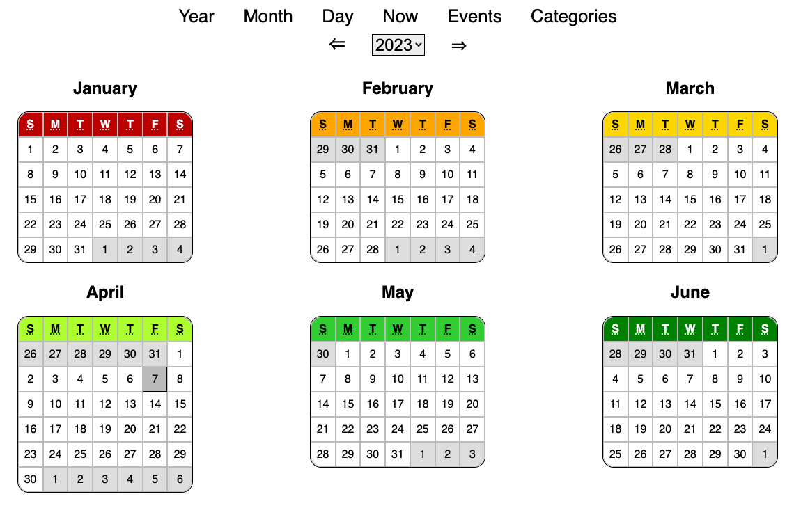
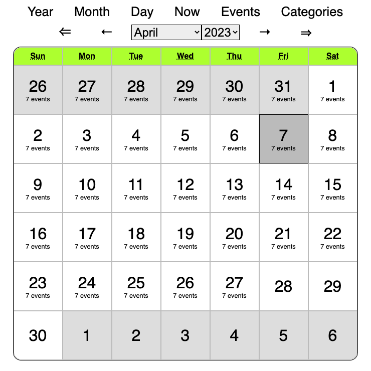

# calendar-vanilla

This is a calendar app built with vanilla JavaScript. It's an exercise to learn
web development fundamentals, using the simplest technology stack: plain HTML,
CSS, & client-side JS.

## Exercise Constraints
- No libraries, frameworks, templates, or preprocessors
- No server side processing (e.g. Node or Deno)
- No dev tools except Git, an editor, and a web browser

## Goals
- [ ] Automate testing
- [x] Support light and dark color themes
- [ ] Support desktop and mobile layouts
- [x] Show a calendar
  - [x] Monthly
  - [x] Yearly
  - [x] Daily
- [x] Identify today
- [x] Allow navigation, forward and backward
- [x] Remember events
- [x] Categorize events
- [ ] Repeat events
- [ ] Set goals (e.g. exercise twice a week)

favicon by [Twemoji](https://twemoji.twitter.com/), licensed as [CC-BY
4.0](https://creativecommons.org/licenses/by/4.0/).
